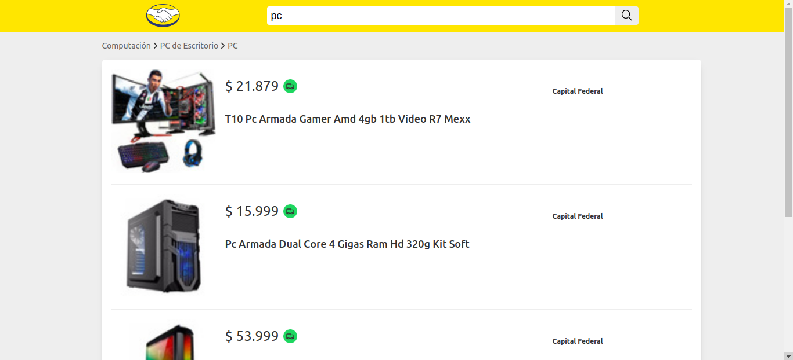
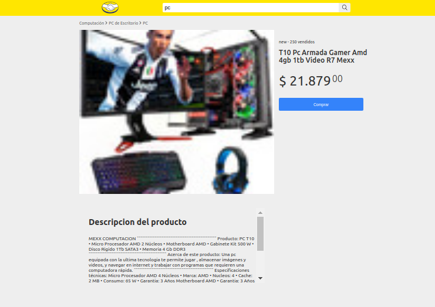

# Challenge Frontend- Meli | Willy David Da Conceicao

Bienvenido! En este repositorio/proyecto podrás encontrar el código de la app. La app es un buscador de productos disponibles en mercadolibre. construido con ReactJS, Redux, CSS modules / Sass, Hooks, Peticiones HTTP y más...
 





# Demo
https://challenge-frontend-meli.vercel.app/

# Instalación

Para poder correr el proyecto en localhost es requerido tener instalado NodeJS en tu equipo y NPM (Node Package Manager) para poder instalar las dependencias necesarias.

Instalar las dependencias.

```sh
$ cd challenge-frontend-meli
$ npm i | o npm install
```

## Scripts / Comandos disponibles

El proyecto cuenta con los siguientes comandos (NPM SCRIPTS)

```sh
$ npm run dev | Corre el proyecto en modo desarrollo puedes abrir la app en el puerto :3000 http://localhost:3000/

$ npm run build | Compila el código para prod

$ npm start OR $ npm run start | Corre el proyecto en modo producción 
```

# Tecnologías Usadas

- NextJS / Framework SSR - Para las funciones backend use las rutas /api/ de NextJS disponible en la carpeta /pages/api/ROUTES y las peticiones de la interface ocurren en el Client Side (navegador)
- ReactJS
- Sass
- Redux

# Rutas de la app

## Frontend
- / | Raíz del proyecto muestra el header
- /items?search=:query: | Lista los productos buscados
- /items/:id: | Muestra información detallada de un solo producto

## Backend | API
- /api/items?q=:query: | Retorna los datos en formato JSON del producto a buscar
- /api/items/:id: | Retorna información detallada de un solo producto formato JSON

### Ejemplo de respuesta del primer endpoint

```json
{
   "author":{
      "name":"Willy David",
      "lastname":"Da Conceicao Lozada"
   },
   "categories":[
      "MLA393761",
      "MLA61216",
      "MLA48877",
      "MLA409140"
   ],
   "breadcrumb":[
      {
         "id":"MLA409431",
         "name":"Salud y Equipamiento Médico"
      },
      {
         "id":"MLA6556",
         "name":"Equipamiento Médico"
      },
      {
         "id":"MLA409095",
         "name":"Instrumental Médico"
      },
      {
         "id":"MLA409140",
         "name":"Guantes Descartables"
      }
   ],
   "items":[
      {
         "id":"MLA674538889",
         "title":"Guantes Gimnasio P/pesas Gym Pilates Fitness Neoprene El Rey",
         "price":{
            "currency":"ARS",
            "amount":719,
            "decimals":99
         },
         "picture":"http://http2.mlstatic.com/D_909925-MLA31017431830_062019-O.jpg",
         "condition":"new",
         "free_shipping":false,
         "location":{
            "state_id":"AR-C",
            "state_name":"Capital Federal",
            "city_id":"TUxBQlZJTDQyMjBa",
            "city_name":"Villa Crespo"
         }
      },
      {},
      {},
      {}
   ]
}
```
